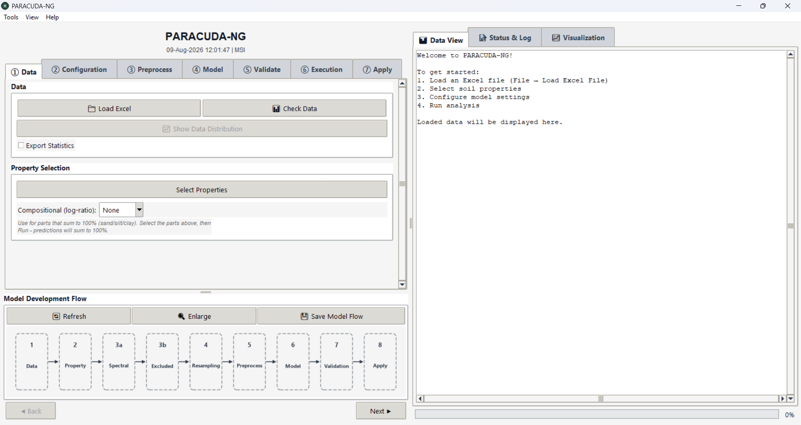
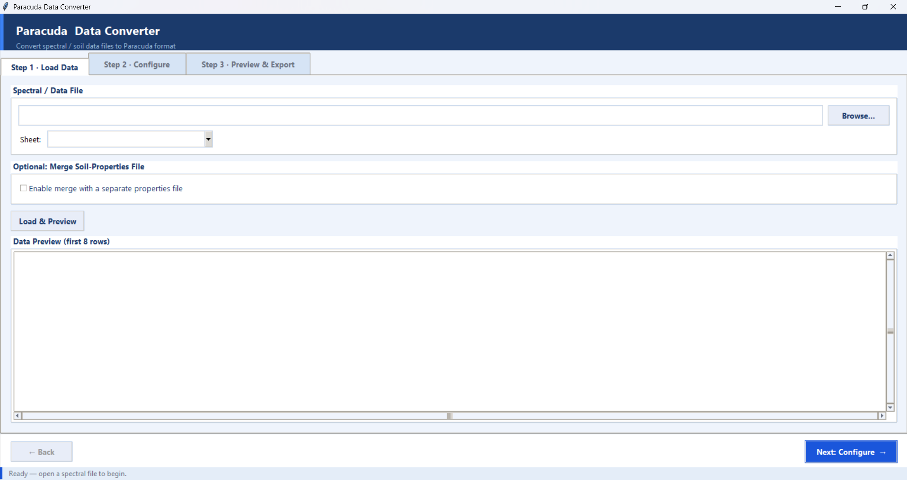

# Paracuda III

Paracuda is an open-source tool for analyzing spectral data and building, validating,
and applying machine-learning prediction models - designed for soil spectroscopy and
hyperspectral remote sensing, but usable for any tabular spectral dataset.

The interface is organized as a **7-step wizard** (Data → Configuration → Preprocess →
Model → Validate → Execution → Apply) with a live *Model Development Flow* diagram, so a
complete workflow - from loading spectra to applying a trained model on a hyperspectral
image - can be run without writing any code.



## Features

### Data Handling
- **Flexible input**: load spectral data from Excel (`.xlsx`, `.xls`, `.ods`) or CSV
- **Data Converter**: a built-in wizard that auto-detects arbitrary instrument layouts
  (row-wise or transposed/column-wise), handles `nm`/`µm` units, optionally merges a
  separate soil-properties file, and exports to the Paracuda-compatible format
- **Data checks & statistics**: inspect loaded data and export summary statistics
- **Multi-property selection**: analyze several soil properties in a single run

### Spectral Processing
- **Preprocessing**: Continuum Removal, First Derivative, Second Derivative, Absorbance
  (plus optional PCA dimensionality reduction in the model pipeline)
- **Band resampling (7 methods)**: Linear, Nearest-Neighbour, Quadratic and Cubic-Spline
  interpolation, Gaussian SRF convolution, Empirical SRF integration, and Band Averaging -
  for harmonizing spectra to a target sensor's band configuration
- **Wavelength exclusion**: drop noisy regions with custom ranges or one-click presets
  (water-absorption bands, noisy detector edges)
- **Custom band definitions**: upload per-band FWHM or full Spectral Response Function
  (SRF) tables for bandwidth-aware resampling

### Modeling
- **Regression models**: PLS-R, SVM, Ridge, Lasso, Multiple Linear Regression, Elastic Net,
  Huber Regressor, Gradient Boosting, Gaussian Process, Random Forest, and XGBoost
- **Compositional modeling**: ALR / CLR / ILR log-ratio transforms so predictions of
  sum-constrained parts (e.g. sand + silt + clay) add up to 100%
- **Hyperparameter tuning**: automated optimization (Optuna) for supported models
- **Cross-validation**: K-Fold, Leave-One-Out, and Leave-P-Out strategies

### Batch Mode
- **Multi-model comparison**: train and compare multiple models automatically
- **Best-fit recommendation**: suggests the best model per property from R², RMSE, and
  cross-validation metrics
- **Automated plots**: observed-vs-predicted scatter plots, reflectance-spectra plots, and
  feature-importance charts (importance bars for tree models; wavelength-correlation plots
  for others)
- **Comprehensive reporting**: Excel workbooks with per-model comparison sheets plus
  multi-page PDF plot reports (model file, Excel report, and PDF share one run timestamp)

### Apply to Images
- **Hyperspectral image prediction**: apply a trained model across a full image cube
- **Multi-format geospatial I/O**: GeoTIFF/TIFF, ENVI (`.dat`/`.bil`/`.bip`/`.bsq` + `.hdr`),
  ERDAS Imagine (`.img`), NITF, and PCIDSK - wavelengths/FWHM are recovered from ENVI headers,
  and predictions are written back in the same format with georeferencing preserved
- **Robust handling**: automatic gain/offset scaling, background/no-data and bad-band masking,
  and memory-safe chunked processing for large scenes
- **Resampled-cube export**: optionally export the resampled image (or tabular spectra) to
  verify the harmonization step

### Interface
- **Themes**: Ocean, Slate, Forest, Light-Contrast, and Dark (View → Theme)
- **Model Development Flow**: a live, themed pipeline diagram that reflects your current
  settings and can be exported at 300 DPI
- **Built-in Help Assistant**: searchable in-app guidance (see `HELP_SYSTEM_README.md`)

## Data Converter

Not every instrument exports data in the layout Paracuda expects. The **Paracuda Data
Converter** (Tools → Data Converter, or run `utils/data_converter.py`) is a three-step
wizard - *Load Data → Configure → Preview & Export* - that auto-detects the layout of an
arbitrary Excel/CSV file and converts it to the standard
`Names | Prop1 … PropN | WL1 … WLM` format.



## Project Structure

Paracuda III is organized into focused packages:

| Path | Contents |
|------|----------|
| `paracuda.py` | Launcher entry point |
| `gui/` | Tkinter application, split into composable mixins |
| `preprocessing/` | Spectral preprocessing, resampling, compositional transforms |
| `models/` | Model training, hyperparameter tuning, batch processing |
| `validation/` | Cross-validation |
| `utils/` | File I/O, data converter, image processing, help assistant |
| `paracuda_theme.py` | Shared color themes |

## Quick Start (One-Click Launcher)

If you're not comfortable installing packages or running scripts from a terminal, just
use the included launcher - **double-click `run_paracuda.bat`**. It automatically:

1. Finds your Conda installation (Miniforge, Miniconda, or Anaconda)
2. Creates the `paracuda` environment and installs everything from `requirements.txt` the
   first time you run it (this one-time setup takes a few minutes)
3. Activates the `paracuda` environment and launches Paracuda III

The only prerequisite is a Conda installation (Miniforge, Miniconda, or Anaconda). If
Conda can't be found, or setup fails, the launcher prints clear guidance and stays open
so you can read the message.

## Installation (Manual)

The tool uses several Python packages listed in `requirements.txt`:

```bash
pip install -r requirements.txt
```

## Usage (Manual)

Run the tool from the repository root:

```bash
python paracuda.py
```

A typical batch workflow:

1. **Data** - load spectral data and select one or more soil properties
2. **Configuration / Preprocess** - choose resampling, exclusions, and preprocessing
3. **Model / Validate** - pick single or multiple models and a cross-validation strategy
4. **Execution** - run the analysis to get an Excel report, PDF plots, and best-model
   recommendations, then save the trained model
5. **Apply** - load a hyperspectral image or new dataset and predict with the saved model

## License

This project is licensed under the Creative Commons Attribution-NonCommercial 4.0
International License - see the [LICENSE](LICENSE) file for details.

## Citation

If you use this software in your research, please cite:

```
@software{Paracuda2026,
author = {Sharad Kumar Gupta},
title = {Paracuda III: An Open-Source Machine Learning tool for Spectroscopic Analysis},
year = {2026},
url = {https://github.com/sharadgupta27/paracuda}
}
```

## Acknowledgement

This software is based on the **Paracuda II** tool:

> Carmon, N., & Ben-Dor, E. (2017). An advanced analytical approach for spectral-based modelling of soil properties. *International Journal of Emerging Technologies and Advanced Engineering*, 7, 90–97.

## Commercial Use

For commercial licensing inquiries, please contact: sharadgupta27@gmail.com
